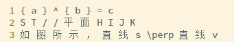

**LaTeX-Formula**

**使用说明** 

- Step1. 克隆 Git 代码至 **/disk*** 的个人目录下，若放置在 **/ssd*** 目录中，将无法通过挂载数据卷的形式与 Docker 容器共享数据（具体原因不详，可能是 Docker 的配置问题，也可能是我的 Docker 命令写的有问题）。

  ```shell
  # 具体路径请根据情况自行调整，此处仅作演示。
  # 注：
  # 拉取的 Docker 镜像基本都存储在 /disk1/docker 中，不建议把数据放到 /disk1 路径下，
  # 满盘将导致其它用户无法正常使用 Docker。
  mkdir -p /disk2/jiangweijw/workspace
  cd /disk2/jiangweijw/workspace
  git clone git@gitlab.corp.youdao.com:jiangweijw/LaTeX-Formula.git
  ```

- Step2. 拉取 Docker 镜像，其内部配置了 LaTeX 和 Python 的运行环境。

  ```shell
  sudo docker pull harbor-registry.inner.youdao.com/data-generator/latex-env:1.0
  ```

- Step3. 创建 Docker 容器。

  ```shell
  # 容器名称：latex-env
  # 共享的数据目录：
  #		宿主机：/disk2/jiangweijw/workspace/LaTeX-Formula
  #	    容器内：/home/jiangweijw/LaTeX-Formula
  sudo docker run --name latex-env -v $PWD/LaTeX-Formula:/home/$USER/LaTex-Formula -it harbor-registry.inner.youdao.com/data-generator/latex-env:1.0 /bin/bash
  
  # 提示：
  # 退出但不关闭容器：Ctrl + p + q
  # 重新进入容器：sudo docker exec -it latex-env /bin/bash
  ```

- Step4. 将预渲染的 LaTeX 公式移动至宿主机的共享目录下，即可在容器内部使用，文件的每一行是一条公式，形如：

  <center></center>

- Step5. 从 Docker 容器内部执行运行 Python 脚本，完成渲染。

  ```shell
  # 进入共享的数据目录
  /home/jiangweijw/LaTeX-Formula
  # 执行脚本
  PYTHONIOENCODING=utf-8 python3 generator.py -i latex_list.txt -o dest -t 32 --prefix=test
  ```

- Step6. 查看渲染结果。

  ```
  dest
  |-- images
  |-- labels.txt
  `-- tmp
  ```

